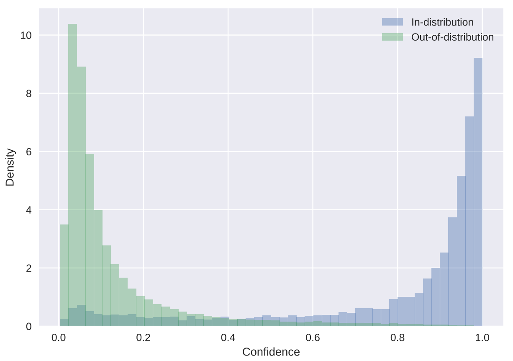
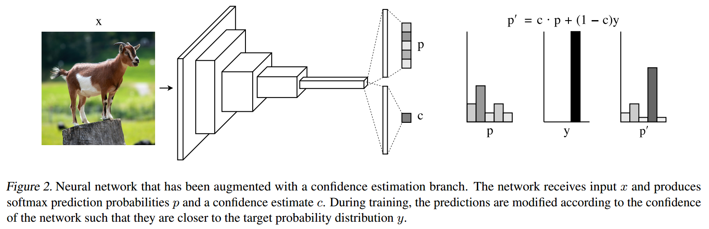
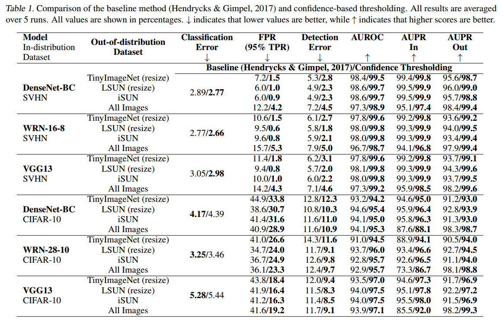

# Learning Confidence Estimates for Neural Networks

This repository contains the code for the paper [Learning Confidence for Out-of-Distribution Detection in Neural Networks](https://arxiv.org/abs/1802.04865). In this work, we demonstrate how to augment neural networks with a confidence estimation branch, which can be used to identify misclassified and out-of-distribution examples.  

<p align="center">

</p>

To learn confidence estimates during training, we provide the neural network with "hints" towards the correct output whenever it exhibits low confidence in its predictions. Hints are provided by interpolating between the predicted distribution and the target distribution, with the amount of interpolation proportional to the network's confidence that its prediction is correct. To discourage the network from always asking for free hints, a small penalty is applied whenever it is not confident. As a result, the network learns to only produce low confidence estimates when it is likely to make an incorrect prediction.

<p align="center">

</p>

Bibtex:  
```
@article{devries2018learning,
  title={Learning Confidence for Out-of-Distribution Detection in Neural Networks},
  author={DeVries, Terrance and Taylor, Graham W},
  journal={arXiv preprint arXiv:1802.04865},
  year={2018}
}
```

## Results and Usage   
We evalute our method on the task of out-of-distribution detection using three different neural network architectures: [DenseNet](https://arxiv.org/abs/1608.06993), [WideResNet](https://arxiv.org/abs/1605.07146), and [VGG](https://arxiv.org/abs/1409.1556). CIFAR-10 and SVHN are used as the in-distribution datasets, while TinyImageNet, LSUN, iSUN, uniform noise, and Gaussian noise are used as the out-of-distribution datasets. Definitions of evaluation metrics can be found in the [paper](https://arxiv.org/abs/1802.04865).

<p align="center">

</p>

### Dependencies  
[PyTorch v0.3.0](http://pytorch.org/)  
[tqdm](https://pypi.python.org/pypi/tqdm)  
[visdom](https://github.com/facebookresearch/visdom)  
[seaborn](https://seaborn.pydata.org/)  
[Pillow](http://python-pillow.org/)  
[scikit-learn](http://scikit-learn.org/stable/)  

### Training

Train a model with a confidence estimator with `train.py`.  

| Args 	| Options 	| Description 	|
|---------|--------|----------------------------------------------------|
| dataset 	| cifar10, <br>svhn 	| Selects which dataset to train on. 	|
| model 	| densenet, <br>wideresnet, <br>vgg13 	| Selects which model architecture to use. 	|
| batch_size 	| [int] 	| Number of samples per batch.	|
| epochs 	| [int] 	| Number of epochs for training. 	|
| seed 	| [int] 	| Random seed.	|
| learning_rate 	| [float] 	| Learning rate. 	|
| data_augmentation 	|  	| Train with standard data augmentation (random flipping and translation). 	|
| cutout 	| [int] 	| Indicates the patch size to use for [Cutout](https://arxiv.org/abs/1708.04552). If 0, Cutout is not used. 	|
| budget 	| [float] 	| Controls how often the network can choose have low confidence in its prediction. Increasing the budget will bias the output towards low confidence predictions, while decreasing the budget will produce more high confidence predictions. 	|
| baseline 	|  	| Train the model without the confidence branch. 	|

The following settings were used for the experiments in the [paper](https://arxiv.org/abs/1802.04865):  
```
python train.py --dataset cifar10 --model vgg13 --budget 0.3 --data_augmentation --cutout 16
```  
```
python train.py --dataset cifar10 --model wideresnet --budget 0.3 --data_augmentation --cutout 16
```  
```
python train.py --dataset cifar10 --model densenet --budget 0.3 --epochs 300 --batch_size 64--data_augmentation --cutout 16
```  
```
python train.py --dataset svhn --model vgg13 --budget 0.3 --learning_rate 0.01 --epochs 160 --data_augmentation --cutout 20
```  
```
python train.py --dataset svhn --model wideresnet --budget 0.3 --learning_rate 0.01 --epochs 160 --data_augmentation --cutout 20
```  
```
python train.py --dataset svhn --model densenet --budget 0.3 --learning_rate 0.01 --epochs 300 --batch_size 64  --data_augmentation --cutout 20
```  

### Out-of-distribution detection

Evaluate a trained model with `out_of_distribution_detection.py`. Before running this you will need to download the out-of-distribution datasets from Shiyu Liang's [ODIN github repo](https://github.com/ShiyuLiang/odin-pytorch#downloading--out-of-distribtion-datasets) and modify the data paths in the file according to where you saved the datasets. 

| Args 	| Options 	| Description 	|
|-------------	|------------	|-------------------------------------------------------------------------	|
| ind_dataset 	| cifar10, <br>svhn 	| Indicates which dataset to use as in-distribution. Should be the same one that the model was trained on. 	|
| ood_dataset 	| tinyImageNet_crop, <br>tinyImageNet_resize, <br>LSUN_crop, <br>LSUN_resize, <br>iSUN, <br>Uniform, <br>Gaussian, <br>all 	| Indicates which dataset to use as the out-of-distribution datset. 	|
| model 	| densenet, <br>wideresnet, <br>vgg13 	| Selects which model architecture to use. Should be the same one that the model was trained on. 	|
| process 	| baseline, <br>ODIN, <br>confidence, <br>confidence_scaling 	| Indicates which method to use for out-of-distribution detection. [Baseline](https://arxiv.org/abs/1610.02136) uses the maximum softmax probability. [ODIN](https://arxiv.org/abs/1706.02690) applies temperature scaling and input pre-processing to the baseline method. Confidence uses the learned confidence estimates. Confidence scaling applies input pre-processing to the confidence estimates. 	|
| batch_size 	| [int] 	| Number of samples per batch. 	|
| T 	| [int] 	| Temperature to use for temperature scaling. 	|
| epsilon 	| [int] 	| Noise magnitude to use for input pre-processing. 	|
| checkpoint 	| [str] 	| Filename of trained model checkpoint. Assumes the file is in the checkpoints/ folder. 	|
| validation 	|  	| Use this flag for fine-tuning T and epsilon. If flag is on, the script will only evaluate on the first 1000 samples in the out-of-distribution dataset. If flag is not used, the remaining samples are used for evaluation. Based on validation procedure from  [ODIN](https://arxiv.org/abs/1706.02690). 	|

Example commands for running the out-of-distribution detection script:  
```
python out_of_distribution_detection.py --ind_dataset svhn --ood_dataset all --model vgg13 --process baseline --checkpoint svhn_vgg13_budget_0.0_seed_0
```  

```
python out_of_distribution_detection.py --ind_dataset cifar10 --ood_dataset tinyImageNet_resize --model densenet --process ODIN --T 1000 --epsilon 0.001 --checkpoint cifar10_densenet_budget_0.0_seed_0
```  

```
python out_of_distribution_detection.py --ind_dataset cifar10 --ood_dataset LSUN_crop --model vgg13 --process confidence --checkpoint cifar10_vgg13_budget_0.3_seed_0
```  

```
python out_of_distribution_detection.py --ind_dataset svhn --ood_dataset iSUN --model wideresnet --process confidence_scaling --epsilon 0.001 --checkpoint svhn_wideresnet_budget_0.3_seed_0
```  
